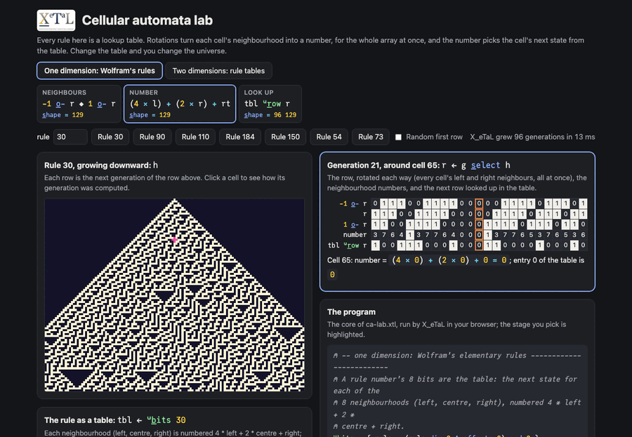

# Cellular automata lab

Every rule in this lab is a lookup table. Rotations turn each cell's
neighbourhood into a number, for the whole array at once, and the
number picks the cell's next state from the table (`s_elect`). Change
the table and you change the universe.

Live: [Cellular automata lab](https://softwarewrighter.github.io/X_eTaL-demos/ca-lab/)
(the two-dimensional rules: [`#2d`](https://softwarewrighter.github.io/X_eTaL-demos/ca-lab/#2d))

[](https://softwarewrighter.github.io/X_eTaL-demos/ca-lab/)

## The program

The core of `ca-lab.xtl` (the live page runs exactly this):

```
u:b_its := { rule -> (rule d_iv 2 ^ o_ffsets 8) m_od 2 }
u:r_ow := { tbl r -> (1 + (4 * -1 o_- r) + (2 * r) + 1 o_- r) s_elect tbl }
u:g_row := { tbl h ->
  g := f_irst s_hape h
  n := 2 s_elect s_hape h
  keep := 1 * ((o_ffsets g) < g - 1) 'l_eft t_able o_ffsets n
  (keep * 1 o_-_1 h) + (1 - keep) * (g c_at n) r_eshape tbl u:r_ow g s_elect h
}
u:c_ount := { b -> ('+ r_/_12 -1 0 1 o_-_12 1 * b = 1) - 1 * b = 1 }
u:l_ook := { tbl b -> (1 + (9 * b) + u:c_ount b) s_elect tbl }
```

## How it works

One dimension (Wolfram's elementary rules):

| Step | Code | Shape | What it is |
| ---- | ---- | ----- | ---------- |
| the table | `u:b_its 30` | 8 | a rule number's 8 bits: the next state for neighbourhood numbers 0 to 7 |
| neighbours | `-1 o_- r`, `1 o_- r` | width | the row rotated each way: every cell's left and right neighbour at once |
| number | `(4 * left) + (2 * r) + right` | width | each cell's neighbourhood as a number 0 to 7 |
| look up | `tbl u:r_ow r` | width | `s_elect` picks each cell's next state from the table |
| history | `tbl u:g_row h` | gens width | rows rotated up, the next row put at the bottom; run with function power |

Two dimensions (Life, Brian's Brain, Wireworld):

| Step | Code | Shape | What it is |
| ---- | ---- | ----- | ---------- |
| count | `u:c_ount b` | rows cols | neighbours in state 1: nine rotated copies of `b = 1` summed, minus the cell |
| number | `(9 * b) + u:c_ount b` | rows cols | state * 9 + count |
| look up | `tbl u:l_ook b` | rows cols | the next state from a table with a row per state and a column per count |

Life is `0 0 0 1 0 0 0 0 0  0 0 1 1 0 0 0 0 0` (dead: born with 3;
alive: survives with 2 or 3). Brian's Brain (off, firing, dying) and
Wireworld (empty, electron head, tail, wire) are tables of 27 and 36
entries; the same two functions run all three.

On the page, the one-dimensional mode grows 96 generations of a
129-cell row, shows the 8-entry table (click an entry to flip it, or
type a rule number), and for a clicked cell shows its generation's
rotated rows, numbers and next row. The two-dimensional mode shows the
rule's table (click an entry to change it), a board you can paint, and
the coming step's counts, numbers and next board, which update as you
edit.

The page's tests check the elementary rules 30, 90, 110 and 184
against a direct computation for all 96 generations, and Life-as-a-
table against Conway's rule cell by cell.

## Run it

```bash
just run ca-lab          # Rule 30, Rule 90, Life, Brian's Brain, Wireworld
just show ca-lab         # the same as a notebook
just serve ca-lab        # the web app at http://127.0.0.1:8095/
just test-demo ca-lab    # its CLI and browser baselines and the web app's tests
```

## Workarounds

The page passes the 2-D board into each run as a literal matrix,
because each run is a fresh X_eTaL program. Booleans are turned into
Ints with `1 *` where they meet the Int state.
