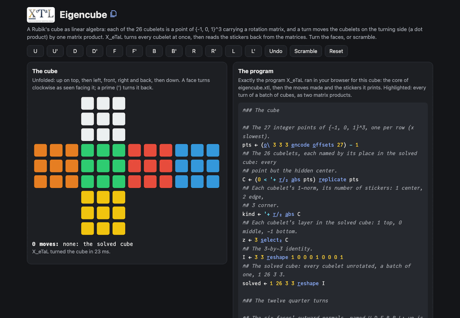

# Eigencube

A Rubik's cube with no sticker tables and no permutation tricks: 26
cubelets, each a point c of {-1, 0, 1}^3 carrying a 3-by-3 rotation
matrix R, so that it sits at R c. A quarter turn picks the cubelets on
its side with a dot product, v . (R c) > 0, and moves them with one
matrix product; the stickers are read back from the matrices. It is a
port of Steffen Smolka's
[eigencube.py](https://github.com/smolkaj/eigencube) (MIT), whose
README tells the idea at length. In X_eTaL a whole batch of cubes is
one n x 26 x 3 x 3 array, so every turn of every cube in a search is
two matrix products, one for the masks and one for the rotations.

Live: [the Eigencube page](https://softwarewrighter.github.io/X_eTaL-demos/eigencube/):
turn the faces, scramble, undo. Each click runs the program below in
your browser and draws the stickers it prints. The page does not solve
yet (see Status).

[](https://softwarewrighter.github.io/X_eTaL-demos/eigencube/)

## The program

The twelve turns as one 36 by 3 matrix `M` (each move's 3-by-3
rotation, a quarter turn about its face's normal v, is v v^T - [v]x,
Rodrigues' formula at -90 degrees), and every turn of a batch of n
3-by-3 matrices at once:

```
u:t_urns := { R ->
  n := t_ally R
  1 3 2 4 t_ranspose (12 3 c_at n c_at 3) r_eshape M '+ '* i_nner 2 1 3 t_ranspose R
}
```

All twelve turns of every cube in a batch S (n 26 3 3): the masks are
one matrix product of the move vectors with where each cubelet sits,
the rotations the other:

```
u:c_hildren := { S ->
  n := t_ally S
  sh := 12 c_at n c_at 26 3 3
  sel := 0 < V '+ '* i_nner o_\ ((n * 26) c_at 3) r_eshape u:p_os S
  T := sh r_eshape u:t_urns ((n * 26) c_at 3 3) r_eshape S
  S12 := sh r_eshape S
  ((12 * n) c_at 26 3 3) r_eshape S12 + (sh r_eshape 9 r_eplicate r_avel sel) * T - S12
}
```

## How it works

Read right to left.

- `pts` is the 27 integer points of {-1, 0, 1}^3 (`e_ncode` of 0 to
  26 in base 3, less 1); `C`, the 26 cubelets, drops the center. A
  cubelet's 1-norm is its number of stickers: 1 a center, 2 an edge,
  3 a corner.
- A cube is 26 rotation matrices; the solved cube is 26 identities,
  shape 1 26 3 3, a batch of one.
- `u:p_os S` is where each cubelet sits, R c, for every cube of a
  batch at once: `'+ r_/_4` of the matrices times the names spread
  along the rows.
- `u:c_hildren S` is every turn of every cube: `sel`, 12 by 26n, is the
  move vectors times the positions (a cubelet turns when the product
  is positive), `T` is every matrix turned every way (`u:t_urns`), and
  the result keeps a matrix where `sel` is 0 and takes the turned one
  where it is 1.
- `u:s_tickers S` reads the colors back: cubelet k shows a sticker on
  face v when v . (R c) = 1, and the sticker's color is the face it
  faced when solved, R^T v, one more matrix product (`N '+ '* i_nner`
  the transposed matrices). The 54 stickers are sorted by face and
  place, giving the 6 by 9 the page draws.

The solver follows eigencube.py's stages: the top and middle layers a
cubelet at a time (17 searches), the bottom edges (8) and the bottom
corners' places (4), each an A* search, then a fixed corner twist,
(L' U' L U) twice, for the endgame. Its goals and heuristics are
matrix products too: a stage counts solved cubelets in chosen sets
(`u:s_core`), and its heuristic sums square roots of each cubelet's
distance from home (eigencube.py's p-norm with p = 1/2). The
distances come from the cube's 24 rotations (`G`, what the turns reach
from the identity) and their Cayley table (`Tm`), both made from the
matrices once, so the search moves 26 orientation numbers per cube
(`u:n_ext`, checked equal to the matrix turns).

## Status

- The model, the turns and the stickers are complete; the page uses
  them.
- The solver solves the top layer in about a second (the command
  line shows it), but the later stages are too slow in X_eTaL to run
  in a page: on a 30-move scramble one bottom-edge stage takes
  minutes, as the A* search grows to hundreds of thousands of cubes.
  A Solve button follows when the search is fast enough.

## Run it

```bash
just run eigencube          # scramble, its stickers, the top layer solved
just show eigencube         # as a notebook: each statement, then its output
just test-demo eigencube    # its CLI and browser baselines and the web app's tests
just serve eigencube        # the web app at http://127.0.0.1:8413/
```

## Workarounds

None.
