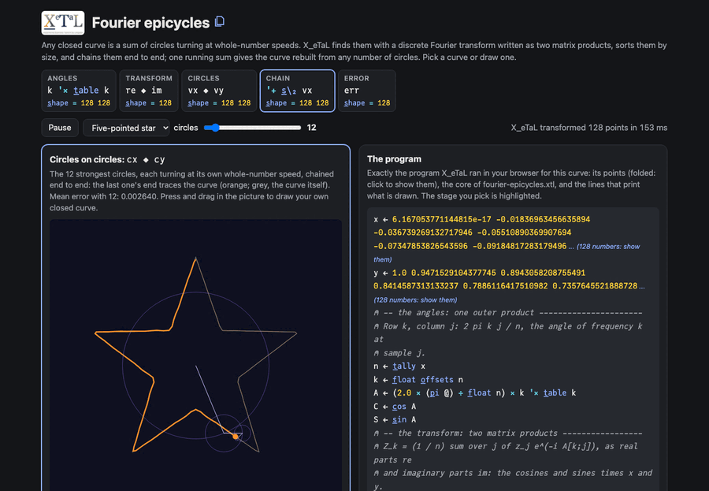

# Fourier epicycles

Any closed curve is a sum of circles turning at whole-number speeds:
chain them end to end, each turning at its own speed, and the end of
the last traces the curve. The page draws a star, a heart, a square, a
flower, a trefoil, or a curve you draw with the mouse, and the circles
that trace it; a slider sets how many circles (strongest first), from
one to all 128.

The array program has no loops: the discrete Fourier transform is two
matrix products with the cosines and sines of one outer product of
angles, and one running sum along the chain of circles gives the curve
rebuilt from every number of circles at once, so the slider needs no
recomputation.

Live: [Fourier epicycles](https://softwarewrighter.github.io/X_eTaL-demos/fourier-epicycles/)

[](https://softwarewrighter.github.io/X_eTaL-demos/fourier-epicycles/)

## The program

From `fourier-epicycles.xtl`: the core the live page runs, on the
curve you pick or draw. The page's program panel shows the whole
program it runs: the curve's points (folded), this core, and the lines
that print what is drawn.

```
n := t_ally x
k := f_loat o_ffsets n
A := (2.0 * (p_i @) / f_loat n) * k '* t_able k
C := c_os A
S := s_in A
re := ((C '+ '* i_nner x) + S '+ '* i_nner y) / f_loat n
im := ((C '+ '* i_nner y) - S '+ '* i_nner x) / f_loat n
amp := ((re * re) + im * im) ^ 0.5
f := k - f_loat n * 1 * k >= f_loat n d_iv 2
order := g_rade n_eg amp
T := (2.0 * (p_i @) / f_loat n) * k '* t_able order s_elect f
zr := (k 'r_ight t_able order s_elect re)
zi := (k 'r_ight t_able order s_elect im)
vx := (zr * c_os T) - zi * s_in T
vy := (zr * s_in T) + zi * c_os T
cx := '+ s_\_2 vx
cy := '+ s_\_2 vy
```

## How it works

| Stage | Code | Shape | What it is |
| ----- | ---- | ----- | ---------- |
| angles | `A` | n n | row k, column j: 2 pi k j / n, one outer product (`'* t_able`) |
| transform | `re`, `im`, `amp` | n | each frequency's part of the curve: the cosines and sines times x and y, two matrix products each |
| speeds | `f` | n | frequency k turns at speed k, or k - n past the middle (the other way round), so the circles stay small |
| circles | `vx`, `vy` | n n | strongest first (`g_rade`): at time j, circle c is its part turned by its speed times the angle of time j |
| chain | `cx`, `cy` | n n | a running sum along the circles: column c is where the first c circles end, the curve rebuilt from c circles |
| error | `err` | n | the mean distance from the curve, for each number of circles |

On the page, the picture draws the circles at the current time, the
curve so far (orange) and the curve itself (grey); the angle table is
drawn as its cosines, the transform as a spectrum of strengths by
speed (the circles in use coloured), and the error as a curve against
the number of circles (log scale). Drawing a curve resamples your path
to 128 points evenly spaced along it.

The page's tests check that all the circles give the curve back, that
a circle is one term, Parseval's theorem (the curve's energy equals the
spectrum's), agreement with a direct Rust transform, that the circles
come strongest first and the error falls as circles are added, and the
resampling of a drawn path.

A transform of 128 points takes about 75 ms natively (about 100 ms in
the browser).

## Run it

```bash
just run fourier-epicycles          # a square: its strengths, the strongest speeds (1, -3, 5, -7), the errors
just show fourier-epicycles         # the same as a notebook
just serve fourier-epicycles        # the web app at http://127.0.0.1:8413/
just test-demo fourier-epicycles    # its CLI and browser baselines and the web app's tests
```

## Workarounds

None needed for the array program. The scan along the chain is
quadratic in the number of circles for a built-in `'+` (an ask in
[`docs/xetal-asks.md`](../../docs/xetal-asks.md)); at 128 circles it
costs about 20 ms. The page writes the curve's points into each run,
because each run is a fresh X_eTaL program.
