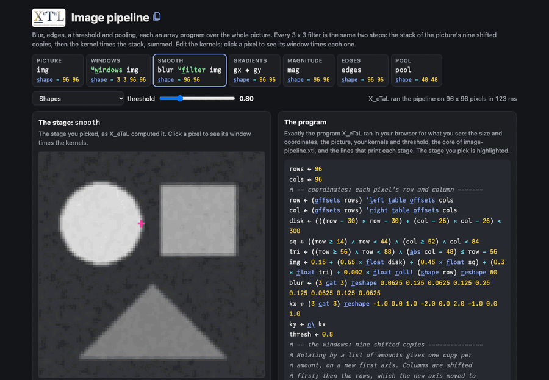

# Image pipeline

Blur, Sobel edges, a threshold and max-pooling on a picture, each an
array program over the whole picture. Every 3 x 3 filter is the same
two steps: the stack of the picture's nine shifted copies (its
windows), then the kernel times the stack, summed. The windows are two
rotations by a list of amounts, so the program has no loops over
pixels or over the kernel. On the page you edit the kernels and click
a pixel to see its window times each one.

Live: [Image pipeline](https://softwarewrighter.github.io/X_eTaL-demos/image-pipeline/)

[](https://softwarewrighter.github.io/X_eTaL-demos/image-pipeline/)

## The program

From `image-pipeline.xtl`: the core the live page runs, with the
picture, kernels and threshold you pick. The page's program panel
shows the whole program it runs: this core, its settings, the data it
writes in (folded) and the lines that print the arrays it draws.

```
u:w_indows := { x -> -1 0 1 o_-_2 -1 0 1 o_-_2 x }
u:f_ilter := { k x -> '+ r_/_12 (u:w_indows x) * k 'l_eft t_able x }
smooth := blur u:f_ilter img
gx := kx u:f_ilter smooth
gy := ky u:f_ilter smooth
mag := ((gx * gx) + gy * gy) ^ 0.5
edges := f_loat mag > thresh
pool := 'm_ax r_/_2 'm_ax r_/_4 ((rows d_iv 2) c_at 2 c_at (cols d_iv 2) c_at 2) r_eshape mag
```

## How it works

| Stage | Code | Shape | What it is |
| ----- | ---- | ----- | ---------- |
| picture | `img` | rows cols | masks of the pixels' coordinates (a disk, a square, a triangle) and a little noise |
| windows | `u:w_indows img` | 3 3 rows cols | item [a;b;r;c] is the pixel at row r + a, column c + b, for a and b in -1 0 1 |
| smooth | `blur u:f_ilter img` | rows cols | the kernel spread over the picture, times the windows, summed over the kernel's two axes |
| gradients | `gx`, `gy` | rows cols | the same filter with the Sobel kernels: the change across and down |
| magnitude | `mag` | rows cols | the edge strength, whichever way the edge runs |
| edges | `edges` | rows cols | 1.0 where the strength passes the threshold |
| pool | `pool` | rows/2 cols/2 | reshaped so each 2 x 2 block has two axes of its own, then the largest over them |

Rotating by a list of amounts gives one rotated copy per amount, on a
new first axis. The windows rotate by `-1 0 1` along axis 2 twice:
the first time axis 2 is the columns; the copy axis it adds moves the
rows to axis 2, so the second rotation shifts the rows. One filter
function serves the blur and both edge kernels.

The page has five pictures (shapes, quadrants and a diagonal, rings, a
noisy checkerboard, half and half), blur presets (Gaussian, box, none,
sharpen) and edge kernels (Sobel, Prewitt, central difference), every
kernel item editable; `ky` is `kx` turned a quarter. Picking a stage
shows it large (the gradients as a color for their direction).
Clicking a pixel shows its window (the nine numbers of the windows
stack there, printed by X_eTaL) times each kernel and the sum, then
the magnitude and the threshold.

The page's tests check every picture with every kernel, the filters
against a direct convolution, that an edited kernel is used (a kernel
of one 1.0 shifts the picture), that the windows are the pixel's
neighbors (wrapping at the edges), the edge orientation on known
pictures (a vertical edge has gx > 0 and gy = 0, a horizontal one the
reverse, a diagonal one gx = -gy), and the pooling.

A run on 96 x 96 pixels (three filters, each over a 3 x 3 x 96 x 96
stack) takes about 60 ms natively with X_eTaL 1c1617e (`docs/bench.md`
has the measurements; `just bench` repeats them).

## Run it

```bash
just run image-pipeline          # 20 x 40 shapes: picture, edge strength, edges, pooled edges as characters
just show image-pipeline         # the same as a notebook
just serve image-pipeline        # the web app at http://127.0.0.1:8413/
just test-demo image-pipeline    # its CLI and browser baselines and the web app's tests
```

## Workarounds

Rotation wraps, so the filters see the picture as a torus: the shapes
picture keeps a plain background at its edges so the wrap does not
show; in the others it shows as edges along the border. The page
writes the picture's program and kernels into each run, because each
run is a fresh X_eTaL program.
