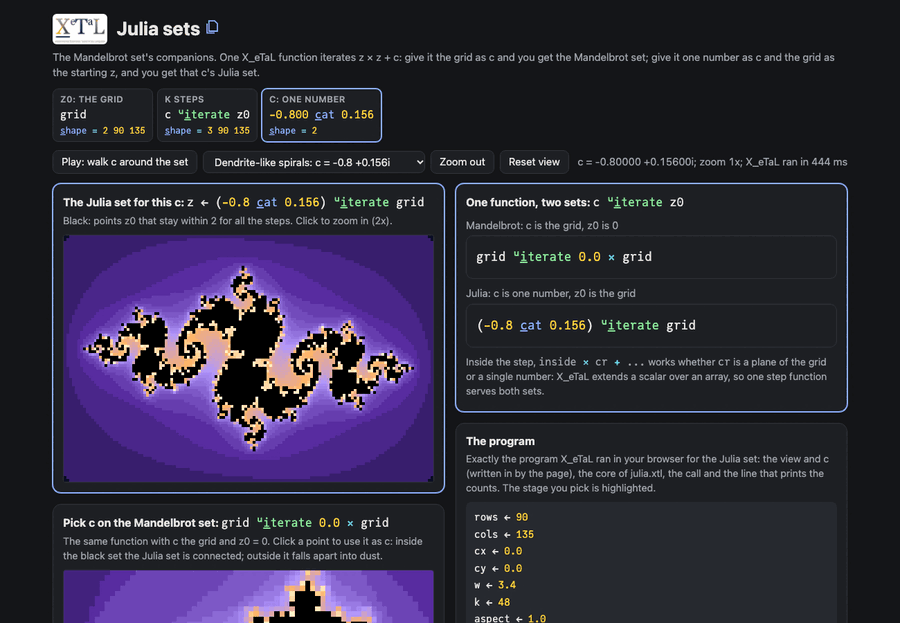

# Julia sets

The Mandelbrot set's companions. One X_eTaL function iterates
z * z + c and counts the steps z stays within 2 of the origin. Give it
the grid of points as c, starting from z = 0, and you get the
Mandelbrot set; give it one number as c and the grid as the starting
z, and you get that c's Julia set. Pick c by clicking the Mandelbrot
map, or press Play and watch the Julia set change shape as c walks
around the edge of the Mandelbrot set.

Live: [Julia sets](https://softwarewrighter.github.io/X_eTaL-demos/julia/)

[](https://softwarewrighter.github.io/X_eTaL-demos/julia/)

## The program

The function at the heart of `julia.xtl`, the core the live page runs.
The page's program panel shows the whole program it runs: this core,
its settings, the data it writes in (folded) and the lines that print
the arrays it draws.

```
u:i_terate := { c z0 ->
  cr := 1 s_elect c
  ci := 2 s_elect c
  s_tep := { s ->
    zr := 1 s_elect s
    zi := 2 s_elect s
    inside := f_loat 4 >= (zr * zr) + zi * zi
    a := (inside * cr + (zr * zr) - zi * zi) + (1 - inside) * zr
    b := (inside * ci + 2 * zr * zi) + (1 - inside) * zi
    (u:p_lane a) c_at (u:p_lane b) c_at u:p_lane inside + 3 s_elect s
  }
  k 's_tep p_ower z0 c_at u:p_lane 0.0 * 1 s_elect z0
}
```

and the two sets:

```
mandel := grid u:i_terate 0.0 * grid
julia := (-0.8 c_at 0.156) u:i_terate grid
```

## How it works

| Part | Code | Shape | What it is |
| ---- | ---- | ----- | ---------- |
| the grid | `grid` | 2 rows cols | the real and imaginary parts of every point, built by broadcasting a row and a column with `t_able` |
| c for a Julia set | `-0.8 c_at 0.156` | 2 | one number's real and imaginary parts |
| c for the Mandelbrot set | `grid` | 2 rows cols | every point is its own c |
| k steps | `c u:i_terate z0` | 3 rows cols | z's two parts and the count of steps inside, after k steps |

`cr := 1 s_elect c` is a number for a Julia set and a matrix for the
Mandelbrot set; `inside * cr + ...` works either way, because X_eTaL
extends a scalar over an array (scalar extension). So the step is
written once.

The page computes the Mandelbrot map once and the Julia set whenever c
or the view changes (90 by 135 points, 48 steps). Clicking the Julia
picture zooms in; Play walks c just outside the main cardioid of the
Mandelbrot set, where Julia sets change quickly.

Checked by the page's tests: a Julia set is symmetric through its
centre (z and -z behave alike); for c = 0 the set is exactly the unit
disk; the same function gives the Mandelbrot set's known points.

## Run it

```bash
just run julia          # a Julia set and the Mandelbrot set, as characters
just show julia         # the same as a notebook
just serve julia        # the web app at http://127.0.0.1:8413/
just test-demo julia    # its CLI and browser baselines and the web app's tests
```

## Workarounds

X_eTaL has no complex numbers yet, so z and c are each two parts
(planes of the grid, or two numbers). A function takes at most two
arguments (left and right), so c and z0 are the two arguments of
`u:i_terate`, and k is a variable bound before it (functions see only
names bound before them).
