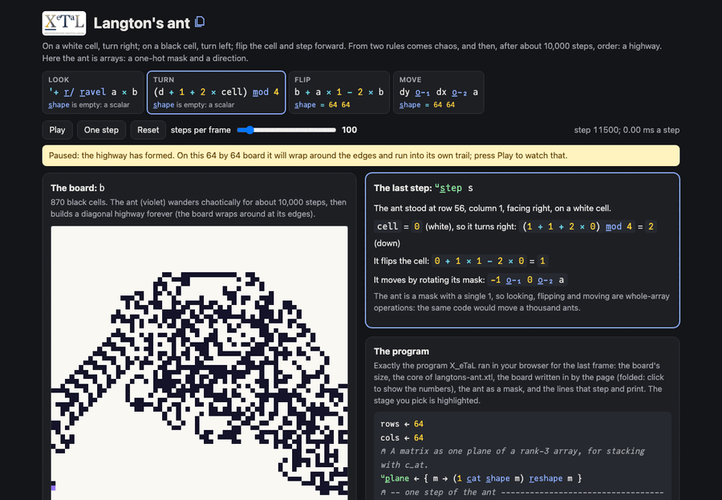

# Langton's ant

On a white cell, turn right; on a black cell, turn left; flip the cell
and step forward. From two rules comes about 10,000 steps of chaos,
and then order: the ant builds a diagonal "highway" forever.

Here the ant is arrays. Its position is a mask with a single 1 and
its direction is a number, so looking at its cell, flipping it and
moving are whole-array operations with no indexing: the same code
would move a thousand ants.

Live: [Langton's ant](https://softwarewrighter.github.io/X_eTaL-demos/langtons-ant/)

[](https://softwarewrighter.github.io/X_eTaL-demos/langtons-ant/)

## The program

The core of `langtons-ant.xtl`, which the live page runs. The page's
program panel shows the whole program it runs: this core, its
settings, the data it writes in (folded) and the lines that print the
arrays it draws.

```
u:s_tep := { (b, a, d) ->
  cell := '+ r_/ r_avel a * b
  turn := (d + 1 + 2 * cell) m_od 4
  flip := b + a * 1 - 2 * b
  dy := (1 * turn = 0) - 1 * turn = 2
  dx := (1 * turn = 3) - 1 * turn = 1
  step := dy o_-_1 dx o_-_2 a
  (flip, step, turn)
}
```

## How it works

| Part | Code | Shape | What it is |
| ---- | ---- | ----- | ---------- |
| look | `'+ r_/ r_avel a * b` | (one number) | the board times the ant's mask, summed: the color under the ant |
| turn | `(d + 1 + 2 * cell) m_od 4` | (one number) | right (+1) on white, left (+3, that is -1) on black |
| flip | `b + a * 1 - 2 * b` | 64 64 | 0 becomes 1 and 1 becomes 0 where the mask is 1, nothing elsewhere |
| move | `dy o_-_1 dx o_-_2 a` | 64 64 | the mask rotated one row or column: up, right, down or left |
| state | `u:s_tep (b, a, d)` | 64 64, a 3-tuple | the board, the mask, and the direction, taken apart by the pattern and given back as a new tuple |

The page runs a number of steps per frame (100 by default) on the
board it keeps, and pauses at step 11,500, when the highway has formed
(on this 64 by 64 board, which wraps at its edges, the highway soon
runs into its own trail), and shows the last step's look, turn, flip and move
with X_eTaL's numbers. Its tests check the X_eTaL ant against a direct
simulation, step for step.

Speed: about 2.2 ms a step natively on the 64 by 64 board (each step
is about ten whole-board operations), so the highway, at about step
10,000, takes 20 to 30 seconds natively and longer in the browser.
Faster array kernels in X_eTaL (planned upstream) would shorten that;
the measurement is in [`docs/xetal-asks.md`](../../docs/xetal-asks.md).

## Run it

```bash
just run langtons-ant          # 400 steps on a 21 by 21 board, as characters
just show langtons-ant         # the same as a notebook
just serve langtons-ant        # the web app at http://127.0.0.1:8413/
just test-demo langtons-ant    # its CLI and browser baselines and the web app's tests
```

## Workarounds

The board goes into each run as a literal matrix. (The direction used
to be kept as a plane of the state, the same number in every cell,
because the state had to be one array; removed now that X_eTaL has
tuples, landed D7: the state is `(b, a, d)`, d a plain scalar.) Listed
in [`docs/xetal-asks.md`](../../docs/xetal-asks.md). There is no
functional update (amend) in X_eTaL yet; here the mask makes one
unnecessary, which is the point of the demo.
