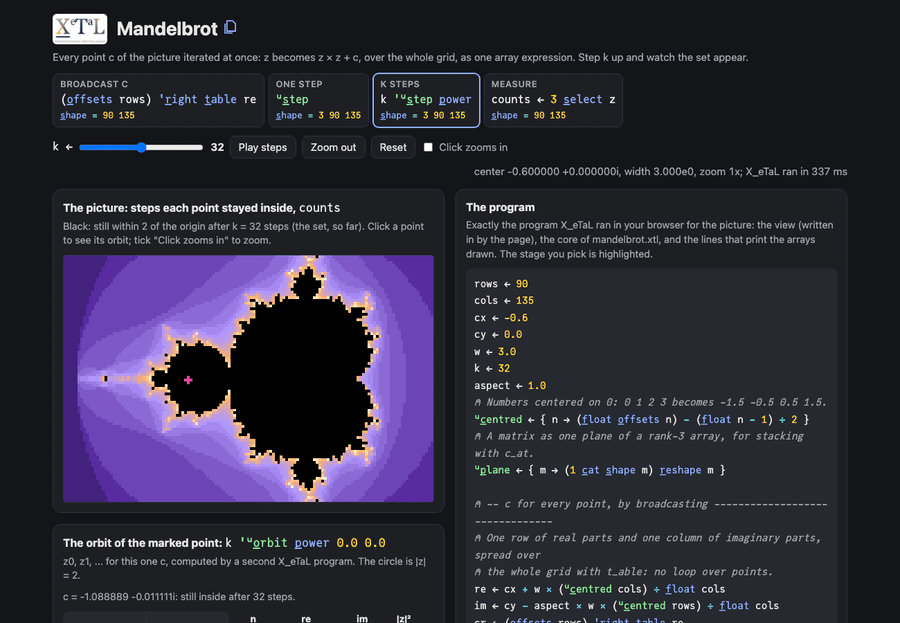

# Mandelbrot

Every point c of the picture is iterated at once: z becomes z * z + c
over the whole grid as one array expression, counting the steps each
point stays within 2 of the origin. Step the count k up and the set
appears, step by step; click a point to see its orbit, or zoom in.

Live: [Mandelbrot](https://softwarewrighter.github.io/X_eTaL-demos/mandelbrot/)

[](https://softwarewrighter.github.io/X_eTaL-demos/mandelbrot/)

## The program

The core of `mandelbrot.xtl` (the live page runs exactly this, with its
own view):

```
re := cx + w * (u:c_entred cols) / f_loat cols
im := cy - aspect * w * (u:c_entred rows) / f_loat cols
cr := (o_ffsets rows) 'r_ight t_able re
ci := im 'l_eft t_able o_ffsets cols
u:s_tep := { s ->
  zr := 1 s_elect s
  zi := 2 s_elect s
  inside := f_loat 4 >= (zr * zr) + zi * zi
  a := (inside * cr + (zr * zr) - zi * zi) + (1 - inside) * zr
  b := (inside * ci + 2 * zr * zi) + (1 - inside) * zi
  (u:p_lane a) c_at (u:p_lane b) c_at u:p_lane inside + 3 s_elect s
}
z := k 'u:s_tep p_ower (3 c_at rows c_at cols) r_eshape 0.0
```

## How it works

| Step | Code | Shape | What it is |
| ---- | ---- | ----- | ---------- |
| a row of real parts | `re` | cols | the real part of c for each column |
| a column of imaginary parts | `im` | rows | the imaginary part of c for each row |
| c everywhere | `(o_ffsets rows) 'r_ight t_able re` and `im 'l_eft t_able o_ffsets cols` | rows cols | `t_able` spreads the row down and the column across: broadcasting, no loop over points |
| one step | `u:s_tep` | 3 rows cols | the state is three planes: z's real part, its imaginary part, and the count of steps spent inside; one step computes z * z + c everywhere, keeps z where the point has already left the disk (the mask `inside`), and adds `inside` to the count |
| k steps | `k 'u:s_tep p_ower` | 3 rows cols | the step applied k times (function power) from z = 0 |
| the picture | `counts` | rows cols | how many steps each point stayed inside; the points still inside after k steps are the set, so far |

On the page, the k slider (or "Play steps") re-runs the program with a
new k, so each picture is exactly what X_eTaL computed after that many
steps. The panels show `cr`, `ci`, `|z|^2` and the inside mask after k
steps. Clicking a point runs a second small program, `u:o_rbit`, for
that one c, and draws its orbit z0, z1, ... against the circle
|z| = 2.

Speed: in Chrome, X_eTaL runs a 72 by 108 grid for k = 32 steps in
about 200 ms, so the page uses 90 by 135 (about 300 ms); the page
shows the time of each run.

## Run it

```bash
just run mandelbrot          # the set as characters, and one point's orbit
just show mandelbrot         # the same as a notebook
just serve mandelbrot        # the web app at http://127.0.0.1:8095/
just test-demo mandelbrot    # its CLI and browser baselines and the web app's tests
```

## Workarounds

X_eTaL has no complex numbers yet, so z and c are each two Float
arrays (their real and imaginary parts) and the state stacks them as
planes; with complex numbers the step would be `z * z + c`. Listed in
[`docs/xetal-asks.md`](../../docs/xetal-asks.md). The orbit table is
computed as two `e_ach` passes (real parts, then imaginary parts),
because `e_ach` cannot yet return a vector per item (nested arrays).
The page writes the view's numbers into the program in their shortest
form, with an exponent when small (`1.5e-7`). Zooming stops at
a width of about 1e-12, where 64-bit floats can no longer tell
neighbouring pixels apart (a limit of the arithmetic, not of X_eTaL).
