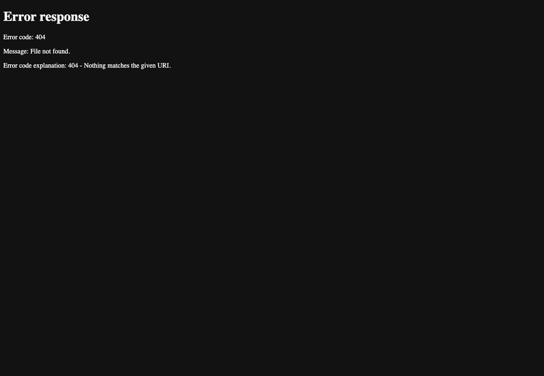

# MoE routing microscope

A mixture-of-experts layer sends each token to only a few of its
experts. Here a sentence's tokens are scored against 16 experts by one
matrix product, each token's scores become probabilities (softmax),
each token keeps its two most likely experts (top-2), and their
probabilities, renormalized, are the gates. The experts sit on a 4 x 4
grid of feature pairs (animal, number, colour, action by place, food,
function word, time), so words route by meaning: "red" to colour
experts, "park" to place experts, "fish" (an animal and a food) to the
animal x food expert. Type your own sentence.

Live: [MoE routing microscope](https://softwarewrighter.github.io/X_eTaL-demos/moe-router/)

[](https://softwarewrighter.github.io/X_eTaL-demos/moe-router/)

## The program

From `moe-router.xtl` (the live page runs these sections on your
sentence):

```
u:s_cores := { x -> 2.0 * x '+ '* i_nner W }
u:s_oftmax := { s ->
  e := e_xp s - ('m_ax r_/_2 s) 'l_eft t_able o_ffsets 16
  e / ('+ r_/_2 e) 'l_eft t_able o_ffsets 16
}
u:t_op2 := { p ->
  m1 := 'm_ax r_/_2 p
  s1 := f_loat p = m1 'l_eft t_able o_ffsets 16
  p2 := p - 2.0 * s1
  m2 := 'm_ax r_/_2 p2
  s2 := f_loat p2 = m2 'l_eft t_able o_ffsets 16
  (p * s1 + s2) / (m1 + m2) 'l_eft t_able o_ffsets 16
}
u:l_oad := { g -> '+ r_/ f_loat g > 0.0 }
```

## How it works

| Stage | Code | Shape | What it is |
| ----- | ---- | ----- | ---------- |
| embed | `ids s_elect E` | tokens 8 | each word's row of the embedding table: 8 features plus a small fixed ripple |
| scores | `u:s_cores x` | tokens 16 | one matrix product with the router weights `W` (8 x 16) |
| softmax | `u:s_oftmax` | tokens 16 | each row as probabilities; the row's largest is taken off first so nothing overflows |
| top-2 | `u:t_op2 p` | tokens 16 | the gates: the two largest probabilities of each row over their sum, 0 elsewhere |
| load | `u:l_oad gates` | 16 | how many tokens each expert got |

Row-wise operations are reductions along axis 2 (`'m_ax r_/_2`,
`'+ r_/_2`) spread back over the row with `t_able`. The vocabulary (37
words, the last `?` for any other word) and the router weights are
written in the program: `W` gives expert (r, c) on the grid weight 2
for feature r and feature 4 + c, plus a ripple.

On the page, the routing picture draws a curve from each token to its
two experts, as wide as the gate; experts are shaded by load and the
selected token (cycling, or clicked) is drawn in colour. The arrays
are shown as pictures (embeddings, scores, probabilities, gates) with
the load as bars, and the inspector shows a token's embedding, its
scores and probabilities on the expert grid, and its gates' arithmetic.

The page's tests check that words are looked up (plurals, unknown
words as `?`), that each row of probabilities sums to 1 and follows
the scores (p_e / p_f = exp(s_e - s_f)), that the top-2 is the two
largest by a direct sort, that the gates sum to 1, that the load counts
each expert's tokens, and that experts specialise by feature.

## Nudge a token

The second part of the program and of the page asks what happens
between words. One word's embedding `x0` is pushed towards another's,
`x0 + eps d1` for eps from 0 to 1.2, and a plane around it is sampled,
`x0 + a d1 + b d2`. Both are outer products (`eps '* t_able d1`), so a
whole path or plane of inputs is one matrix through the same router.

```
x0 := w0 s_elect E
d1 := (wa s_elect E) - x0
d2 := (wb s_elect E) - x0
eps := 1.2 * (f_loat o_ffsets k) / f_loat k - 1
xs := (eps '* t_able d1) + (o_ffsets k) 'r_ight t_able x0
gs := u:t_op2 u:s_oftmax u:s_cores xs
xg := (sa '* t_able d1) + (sb '* t_able d2) + (o_ffsets side * side) 'r_ight t_able x0
gg := u:t_op2 u:s_oftmax u:s_cores xg
```

The page shows the gates along the path as a strip (experts down, eps
across), lists the eps values where the chosen pair changes (pushing
"green" towards "fox", eight times), and colours the plane by the
chosen pair. The point it makes: inputs that are almost the same can
go to different experts. The scores are linear in the input, so the
regions where a pair of experts wins are cut by straight lines, where
two experts' scores tie; a small step across a line switches experts,
a large step inside a region changes nothing.
[moe-microscope](https://github.com/sw-ml-study/moe-microscope)
builds and inspects whole mixture-of-experts models at this scale.

The page's tests check every sample's pair against scores computed
directly, that the boundaries fall exactly in the intervals a 1000
times finer direct computation finds (for three paths), and every
point of the plane against direct scores.

## Run it

```bash
just run moe-router          # the red fox sentence: experts, gates, load; then the nudge
just show moe-router         # the same as a notebook
just serve moe-router        # the web app at http://127.0.0.1:8095/
just test-demo moe-router    # its CLI and browser baselines and the web app's tests
```

## Workarounds

The top-2 is found with masks (the largest of each row, taken out,
then the largest again) because `g_rade` cannot grade each row of a
matrix (an ask in [`docs/xetal-asks.md`](../../docs/xetal-asks.md)).
The page passes the word numbers as Floats, floored, because long Int
strands are slow to read (the same file).
