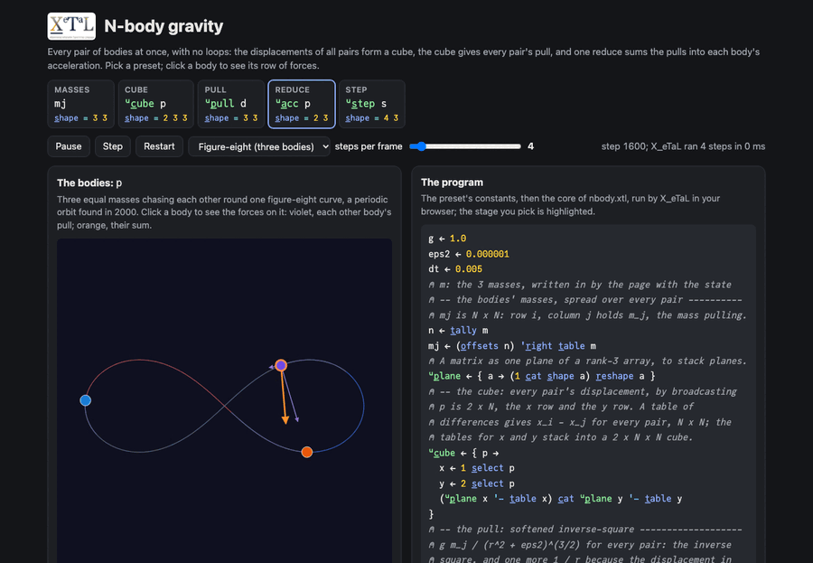

# N-body gravity

Gravity between every pair of bodies at once, with no loops. The
displacements of all pairs form a cube (2 x N x N, built by
broadcasting with `t_able`); the cube gives every pair's softened
inverse-square pull; one reduce along the second body sums the pulls
into each body's acceleration; a kick-drift-kick (leapfrog) step moves
them all. The double loop over pairs that an N-body program usually
starts with is a table and a reduce.

Live: [N-body gravity](https://softwarewrighter.github.io/X_eTaL-demos/nbody/)

[](https://softwarewrighter.github.io/X_eTaL-demos/nbody/)

## The program

From `nbody.xtl` (the live page runs this core, with the constants and
bodies of the preset you pick):

```
n := t_ally m
mj := (o_ffsets n) 'r_ight t_able m
u:p_lane := { a -> (1 c_at s_hape a) r_eshape a }
u:c_ube := { p ->
  x := 1 s_elect p
  y := 2 s_elect p
  (u:p_lane x '- t_able x) c_at u:p_lane y '- t_able y
}
u:p_ull := { d -> g * mj / (('+ r_/ d * d) + eps2) ^ 1.5 }
u:a_cc := { p ->
  d := u:c_ube p
  w := u:p_ull d
  n_eg '+ r_/_3 d * (2 c_at s_hape w) r_eshape w
}
u:s_tep := { s ->
  p := 2 t_ake s
  h := (2 d_rop s) + (dt / 2.0) * u:a_cc p
  p1 := p + dt * h
  p1 c_at h + (dt / 2.0) * u:a_cc p1
}
```

## How it works

| Part | Code | Shape | What it is |
| ---- | ---- | ----- | ---------- |
| the masses | `mj` | N N | row i, column j holds m_j, the mass pulling on body i |
| the cube | `u:c_ube p` | 2 N N | for x and for y, the table of differences p_i - p_j: every pair's displacement |
| the pull | `u:p_ull d` | N N | g m_j / (r^2 + eps2)^1.5; the softening eps2 keeps close passes finite |
| the reduction | `u:a_cc p` | 2 N | each plane of the cube times the pull, summed along j (axis 3), negated |
| the step | `u:s_tep s` | 4 N | half a kick, a drift, half a kick: positions then velocities |

A body and itself sit on the diagonal: the displacement there is 0, so
its huge pull is multiplied by 0 and needs no mask.

The page has four presets: the figure-eight (three equal masses on one
curve, Chenciner and Montgomery's orbit), a binary star with five
light planets, a collapsing cluster of 50 bodies, and a two-body
Kepler ellipse with its period from Kepler's third law. Bodies leave
trails; the cube's planes, the pull and the parts of the reduction are
drawn as N x N pictures (log scale for the pull). Clicking a body (or
a row of a picture) shows its row of the cube: each other body's
displacement, pull and part of the acceleration, the arithmetic of the
strongest one, and their sum as X_eTaL computed it, with arrows on
the sky. The page also shows the energy's drift and the total
momentum.

The page's tests check that the cube is every pair's displacement,
that forces are equal and opposite (m_i a_ij = -m_j a_ji), that the
reduce is the sum of each row of parts, that momentum is conserved,
that X_eTaL agrees with a direct Rust double loop (accelerations and
10 steps), that the two bodies return after Kepler's period (and are
1.5 apart, a(1 + e), half a period on), and that the figure-eight
comes round after its period with its energy kept.

A 50-body step (two accelerations, about 40,000 element operations)
takes about 3 ms natively.

## Run it

```bash
just run nbody          # the figure-eight: the cube, accelerations, 50 steps, momentum
just show nbody         # the same as a notebook
just serve nbody        # the web app at http://127.0.0.1:8095/
just test-demo nbody    # the expected output and the web app's tests
```

## Workarounds

The cube's component axis comes first (2 x N x N rather than
N x N x 2) because `c_at` stacks along the first axis; the reduce over
the other body is then along axis 3. Vectors do not extend over
matrices, so the masses are spread over the pairs with `t_able`
(`mj`) and the pull over the two planes with `r_eshape`. The page
passes the bodies into each run as a literal strand, because each run
is a fresh X_eTaL program (the `xetal-play` arrays ask in
[`docs/xetal-asks.md`](../../docs/xetal-asks.md)).
