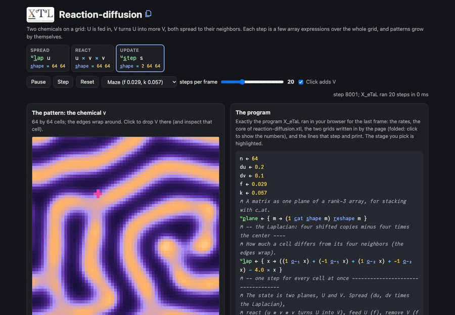

# Reaction-diffusion

Two chemicals, U and V, on a grid. U is fed in, V turns U into more V
(U + 2V -> 3V), V is removed, and both spread to their neighbours: the
Gray-Scott model. Mazes, coral and spots grow by themselves. Every
step is a few array expressions over the whole grid: four shifted
copies for the spreading, products for the reaction. No loop over
cells.

Live: [Reaction-diffusion](https://softwarewrighter.github.io/X_eTaL-demos/reaction-diffusion/)

[](https://softwarewrighter.github.io/X_eTaL-demos/reaction-diffusion/)

## The program

The core of `reaction-diffusion.xtl` (the live page runs exactly this):

```
u:l_ap := { x -> ((1 o_-_1 x) + (-1 o_-_1 x) + (1 o_-_2 x) + -1 o_-_2 x) - 4.0 * x }
u:s_tep := { s ->
  u := 1 s_elect s
  v := 2 s_elect s
  uvv := u * v * v
  (u:p_lane u + ((du * u:l_ap u) - uvv) + f * 1.0 - u) c_at u:p_lane v + ((dv * u:l_ap v) + uvv) - (f + k) * v
}
```

## How it works

| Step | Code | Shape | What it is |
| ---- | ---- | ----- | ---------- |
| spread | `u:l_ap u` | 64 64 | the grid rotated one cell up, down, left and right (`o_-_1`, `o_-_2`), the four copies added, minus four times the grid: the five-point Laplacian, how much each cell differs from its neighbours |
| react | `u * v * v` | 64 64 | where V meets U, U turns into V |
| update | `u:s_tep s` | 2 64 64 | new U = U + du * lap U - UVV + f (1 - U); new V = V + dv * lap V + UVV - (f + k) V; the state is two planes, stacked with `c_at` |
| run | `steps 'u:s_tep p_ower s0` | 2 64 64 | the step applied many times |

The diffusion rates are du = 0.2 and dv = 0.1 (a stable explicit step
for this stencil); the feed f and kill k pick the pattern: maze
(0.029, 0.057), coral (0.0545, 0.062), ripples (0.022, 0.051), spots
(0.035, 0.065), worms (0.046, 0.063).

On the page, each frame runs X_eTaL for a number of steps (20 by
default) on the grid the page keeps, and X_eTaL prints the arrays of
the last step: U, V, both Laplacians, the reaction and the new U and
V. The panels draw them; clicking a cell shows its neighbours, and the
arithmetic of its update with the numbers X_eTaL computed. With "Click
adds V" ticked, a click also drops a square of V there.

Speed: a 64 by 64 frame of 20 steps takes about 80 ms natively
(including passing the grid in and reading it back); the page shows
the time of each run.

## Run it

```bash
just run reaction-diffusion          # a maze grown from a square, drawn as characters
just show reaction-diffusion         # the same as a notebook
just serve reaction-diffusion        # the web app at http://127.0.0.1:8095/
just test-demo reaction-diffusion    # its CLI and browser baselines and the web app's tests
```

## Workarounds

The page keeps the grid between frames and passes it into each run as
two literal matrices (values smaller than 1e-15 are written as 0, to
keep them short), because each run is a fresh X_eTaL program.
