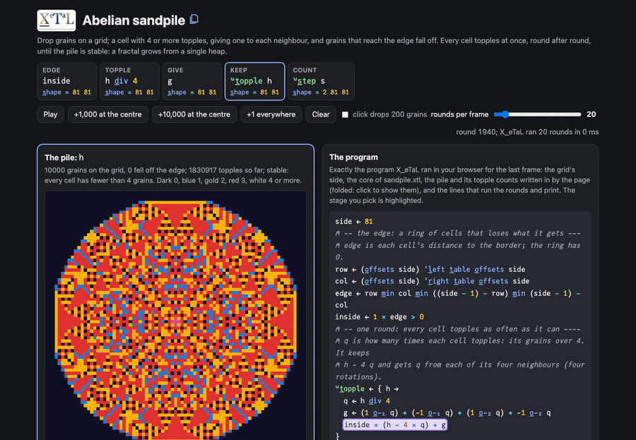

# Abelian sandpile

Drop grains on a grid. A cell with 4 or more grains topples: it gives
one grain to each of its four neighbours, and grains that reach the
edge fall off. Toppling can set off its neighbours, an avalanche, until
every cell has fewer than 4. Drop ten thousand grains on one cell and
the pile settles into a fractal with four-fold symmetry. Add more at
the centre, anywhere you click, or one on every cell, and watch the
avalanches.

The order the cells topple in does not matter (that is what abelian
means), so the array program lets every cell topple at once, as many
times as it can, in one expression per round.

Live: [Abelian sandpile](https://softwarewrighter.github.io/X_eTaL-demos/sandpile/)

[](https://softwarewrighter.github.io/X_eTaL-demos/sandpile/)

## The program

From `sandpile.xtl`: the core the live page runs. The page's program
panel shows the whole program it runs: this core, the pile and its
topple counts written in by the page (folded), and the lines that run
the rounds and print.

```
row := (o_ffsets side) 'l_eft t_able o_ffsets side
col := (o_ffsets side) 'r_ight t_able o_ffsets side
edge := row m_in col m_in ((side - 1) - row) m_in (side - 1) - col
inside := 1 * edge > 0
u:t_opple := { h ->
  q := h d_iv 4
  g := (1 o_-_1 q) + (-1 o_-_1 q) + (1 o_-_2 q) + -1 o_-_2 q
  inside * (h - 4 * q) + g
}
u:s_table := { h -> 1 * 4 > 'm_ax r_/_12 h }
u:p_lane := { m -> (1 c_at s_hape m) r_eshape m }
u:s_tep := { s ->
  h := 1 s_elect s
  (u:p_lane u:t_opple h) c_at u:p_lane (2 s_elect s) + h d_iv 4
}
```

## How it works

| Stage | Code | Shape | What it is |
| ----- | ---- | ----- | ---------- |
| edge | `inside` | side side | 1 inside, 0 on the outer ring: each cell's distance to the border, from `row` and `col` |
| topple | `q := h d_iv 4` | side side | how many times each cell topples this round (as many as it can) |
| give | `g` | side side | what each cell gets: four rotations of `q` |
| keep | `inside * (h - 4 * q) + g` | side side | what it kept plus what it got; the edge's grains fall off |
| count | `u:s_tep s` | 2 side side | the grains, and each cell's topples so far |

On the page, each frame runs a number of rounds (20 by default) on the
pile the page keeps, until the pile is stable; the pile is coloured by
grains (0 dark, 1 blue, 2 gold, 3 red, 4 or more white), and beside it
are who topples next and the topple counts (the avalanche's shape). The
inspector shows a cell's arithmetic for the coming round.

The page's tests check that a round is the same as a direct Rust
round, that a settled pile is stable and keeps its grains inside, that
grains are conserved except those given to the edge, that the order
of dropping does not matter (the abelian property), and that a drop at
the centre settles with four-fold symmetry. The conservation test
found a bug in the first version of the edge mask (one side of the
ring kept its grains).

Twenty rounds on 81 x 81 take about 50 ms natively, 70 ms in the
browser.

## Run it

```bash
just run sandpile          # 300 grains at the centre of a 21 x 21 grid, settled, as characters
just show sandpile         # the same as a notebook
just serve sandpile        # the web app at http://127.0.0.1:8413/
just test-demo sandpile    # its CLI and browser baselines and the web app's tests
```

## Workarounds

The topple counts are a second plane of the state, because a state is
one array (the records ask in
[`docs/xetal-asks.md`](../../docs/xetal-asks.md)). The page writes the
pile into each run, because each run is a fresh X_eTaL program.
