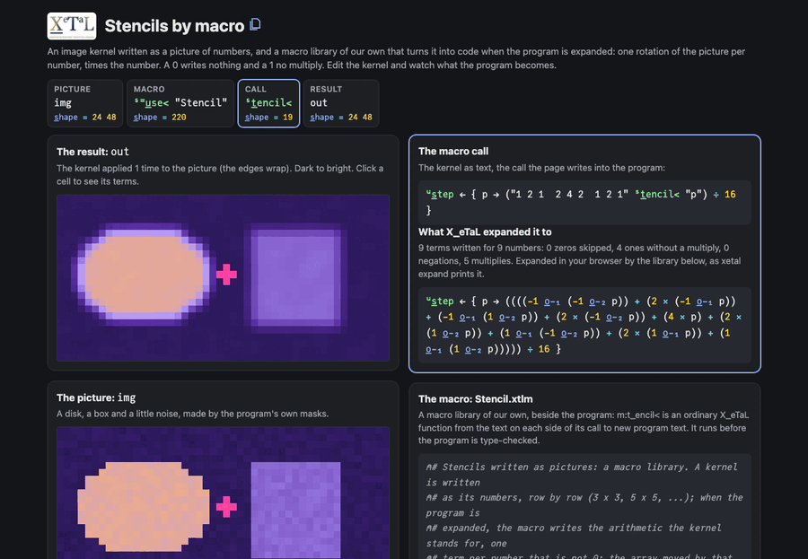

# Stencils by macro

An image kernel is a small picture of numbers: the blur is
`1 2 1 / 2 4 2 / 1 2 1`, the edge finder `-1 -1 -1 / -1 8 -1 / -1 -1 -1`.
Each cell of the result is its neighbors times those numbers, summed.
Here a kernel is written just like that, as text, and a macro library
of our own, `Stencil.xtlm`, turns it into code when the program is
expanded: one rotation of the picture per number, times the number.
A 0 writes nothing and a 1 writes no multiply, so each stencil costs
exactly the work its kernel asks for. The program applies a blur,
edges, sharpen, emboss and sixty steps of heat flow.

This is X_eTaL's third way to extend the language (after libraries,
and before native extensions): a macro is an ordinary X_eTaL function
from the source text on each side of its call to new source text, run
before the program is type-checked. `xetal expand` shows what the
program becomes.

Live: [Stencils by macro](https://softwarewrighter.github.io/X_eTaL-demos/stencil-macros/)

[](https://softwarewrighter.github.io/X_eTaL-demos/stencil-macros/)

## The program

From `stencil-macros.xtl`:

```
"s:" u_se< "Stencil"

u:b_lur := { p -> ("1 2 1  2 4 2  1 2 1" s:t_encil< "p") / 16 }
u:e_dges := { p -> "-1 -1 -1  -1 8 -1  -1 -1 -1" s:t_encil< "p" }
u:s_harpen := { p -> "0 -1 0  -1 5 -1  0 -1 0" s:t_encil< "p" }
u:e_mboss := { p -> "-2 -1 0  -1 1 1  0 1 2" s:t_encil< "p" }
u:h_eat := { p -> p + 0.2 * "0 1 0  1 -4 1  0 1 0" s:t_encil< "p" }

warm := 60 'u:h_eat p_ower spot
```

`xetal expand stencil-macros.xtl` shows the same lines after the
macros ran (kept in `expected/stencil-macros.expanded.xtl`). The heat
step, for one:

```
u:h_eat := { p -> p + 0.2 * (((-1 o_-_1 p) + (-1 o_-_2 p) + (-4 * p) + (1 o_-_2 p) + (1 o_-_1 p))) }
```

The four zeros of its kernel are gone, its four 1s are plain
rotations, and only the center is multiplied.

## How it works

The macro, `m:t_encil<` in `Stencil.xtlm`, is X_eTaL code working on
text:

| Step | Code | What it is |
| ---- | ---- | ---------- |
| read | `n_umbers kernel` | the kernel's numbers, as Floats |
| size | `n h:s_ide 1` | the side k of the square (1, 3, 5, ...); any other count is refused with `[]R_EJECT` |
| offsets | `(i d_iv k) - c`, `(i m_od k) - c` | each number's row and column offset from the center |
| cells | `r_avel o_\ (3 c_at n) r_eshape ...` | weight, row offset, column offset, for each number |
| terms | `h:t_erms`, `h:t_erm` | for each weight that is not 0: the array rotated by the offsets (`o_-_1` rows, `o_-_2` columns), times the weight, as text |
| join | `" + "` | the terms, each in parentheses, summed |

Each term is parenthesized because X_eTaL reads right to left: written
out bare, `a + b - 4 * c + d` would subtract `4 * c + d`. The edges
wrap (rotation), so a blur and a heat step keep the picture's total
exactly; the program prints both totals, and the edges' total, 0.

`check.xtl` checks the macro against the kernel applied as data, the
way image-pipeline filters: the stack of the picture's nine shifted
copies times the kernel, summed. For five kernels (with fractions,
negatives, a single offset, all zeros and a 1 x 1) the two agree
exactly. The library's own doc examples run with
`xetal doc --test Stencil.xtlm`.

## The page

Pick a preset (blur, edges, sharpen, emboss, Sobel, heat, a move, the
identity, a 5 x 5 blur, a 5 x 5 motion blur) or edit any number of
the kernel, its side (3 x 3 or 5 x 5), what the sum is divided by,
and how many steps it is applied. The page writes the kernel into one
line of the program, `u:s_tep := { p -> "..." s:t_encil< "p" }`, and
X_eTaL, compiled to WebAssembly, expands that call with the demo's
own `Stencil.xtlm` and runs the program on the picture. Beside the
result are the call, the line it expanded to (with how many terms,
skipped zeros, plain ones, negations and multiplies), the macro, and
exactly the program that ran. Click a cell to see its terms: each
nonzero number times the neighbor it weighs, summed, against X_eTaL's
value there.

The page's tests check every preset, an edited kernel and its resizing
against a direct loop; that the expansion writes one term per nonzero
number and a multiply only for numbers other than 1 and -1; the heat
step's exact expansion; that a cell's terms sum to its result; and
that a kernel that is not square is refused by the macro.

## Run it

```bash
just run stencil-macros          # run the program
just show stencil-macros         # as a notebook: each statement, then its output
just test-demo stencil-macros    # its CLI baselines (reg-rs), the expansion, the doc examples
bin/xetal expand demos/stencil-macros/stencil-macros.xtl   # the program after the macros ran
```

## Workarounds

- The page reaches past `xetal-play`, X_eTaL's engine for pages, to
  three of its crates: `xetal-store` (to put `Stencil.xtlm` where a run
  finds its libraries), `xetal-macro` (the library lookup) and
  `xetal-program` (the expansion, as `xetal expand` prints it).
  `xetal-play` offers neither; see "a page's own macro library" in
  [`docs/xetal-asks.md`](../../docs/xetal-asks.md).
