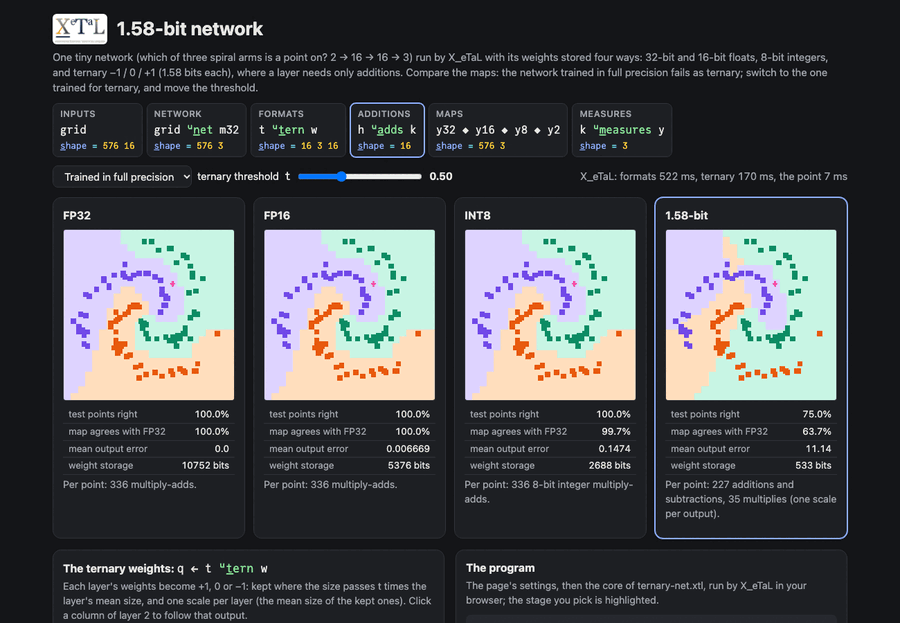

# 1.58-bit network

One tiny network (which of three spiral arms is a point on? 2 -> 16 ->
16 -> 3, ReLU between layers) run with its weights stored four ways:
32-bit and 16-bit floats (simulated by rounding), 8-bit integers, and
ternary -1 / 0 / +1, which takes log2 3 = 1.58 bits a weight. The same
points go through all four, and the page compares the decision maps,
accuracy on test points, agreement with FP32, output error, storage
and operations. In a ternary layer there are no multiplications: each
output adds the inputs whose weight is +1, subtracts those whose
weight is -1, and is multiplied once by the layer's scale.

The surprise: the network trained in full precision gets every test
point right in FP32, FP16 and INT8, but only 75% as ternary. The same
network fine-tuned for ternary weights (BitNet b1.58 style) gets every
test point right as ternary.

Live: [1.58-bit network](https://softwarewrighter.github.io/X_eTaL-demos/ternary-net/)

[](https://softwarewrighter.github.io/X_eTaL-demos/ternary-net/)

## The program

From `ternary-net.xtl` (the live page runs these sections, with the
weights, threshold and point you pick):

```
u:l_ayer := { x p -> (x '+ '* i_nner 16 t_ake p) + (o_ffsets t_ally x) 'r_ight t_able f_irst -1 t_ake p }
u:r_elu := { x -> 0.0 m_ax x }
u:n_et := { x k ->
  h := u:r_elu x u:l_ayer 1 s_elect_2 k
  h := u:r_elu h u:l_ayer 2 s_elect_2 k
  3 t_ake_2 h u:l_ayer 3 s_elect_2 k
}
u:t_ern := { k x ->
  s := k * u:l_ayers ('+ r_/_13 a_bs x) / nw
  (f_loat x > s) - f_loat x < n_eg s
}
q := t u:t_ern w
a := u:l_ayers ('+ r_/_13 (a_bs w) * a_bs q) / 1.0 m_ax '+ r_/_13 a_bs q
u:a_dds := { h k -> ('+ r_/ (h 'l_eft t_able o_ffsets 16) * f_loat k = 1.0) - '+ r_/ (h 'l_eft t_able o_ffsets 16) * f_loat k = -1.0 }
```

## How it works

| Part | Code | Shape | What it is |
| ---- | ---- | ----- | ---------- |
| the model | `fp`, `qa` | 17 3 16 | for each row (16 inputs, padded with 0, then the bias), layer and output: the whole network as one array |
| inputs | `grid`, `test` | points 16 | each point (x, y) as a row of 16: `x e1 + y e2` |
| the network | `u:n_et` | points 3 | three layers, each a matrix product plus the biases, ReLU between |
| FP32, FP16 | `u:f_loats` | 16 3 16 | each weight rounded to 23 or 10 bits after its leading one |
| INT8 | `u:i_nt8` | 16 3 16 | each layer scaled so its largest weight is 127, rounded |
| ternary | `q`, `a` | 16 3 16 | +1 or -1 where a weight's size passes t times its layer's mean size, else 0; a scale per layer |
| additions | `u:a_dds` | 16 | for one input vector, the sum of the inputs under +1 minus those under -1 |
| measures | `u:m_easures` | 3 | accuracy on the test points, agreement with FP32 over the map, mean output error |

Per-layer values (a mean, a largest weight) are reduced over axes 1
and 3 at once (`r_/_13`) and spread back over the layer
(`u:l_ayers`). The biases stay in full precision in every format.

The weights are trained offline by `train/` (a small Rust program with
no dependencies: Adam, softmax cross-entropy, 300 points; then 3000
more steps where the forward pass uses the ternarized weights and the
gradient updates the full-precision ones behind them, the
straight-through estimator) and written into `ternary-net.xtl` as
literals (`just ternary-train`, then `just bless ternary-net`).

On the page, the four cards show each format's map with the test
points, its measures, storage and operations. The threshold slider
reruns the ternary weights; the weight set switches between the
network trained in full precision and the one trained for ternary.
The glyph grids show every ternary weight; clicking a column of layer
2 shows that output for the chosen point as a list of additions and
subtractions, the scale and bias, and the same number from the matrix
product. Clicking a map picks the point.

The page's tests check that training for ternary is what makes ternary
work (100% against 75%), that FP32 is the reference and the coarser
formats drift more (FP16 < INT8 < ternary in output error), that the
ternary weights are -1, 0 or +1 with the padding 0, that a higher
threshold keeps fewer weights, that a ternary layer equals its masked
sums (additions, then one multiply by the scale), and that the network
agrees with a direct forward pass in Rust.

## Run it

```bash
just run ternary-net          # glyphs, the measures of all four formats, storage, the maps
just show ternary-net         # the same as a notebook
just serve ternary-net        # the web app at http://127.0.0.1:8095/
just test-demo ternary-net    # its CLI and browser baselines and the web app's tests
just ternary-train            # retrain and rewrite the weights (then just bless ternary-net)
```

## Workarounds

The network is one 17 x 3 x 16 array, padded to 16 wide, because a
function takes at most two arguments: the formats are functions of the
model, and the network takes the points and the model. Activations
stay in full precision (only weights are quantized), and FP16 is
simulated by rounding the mantissa (its smaller exponent range is not
modelled). The matrix product is slow (an ask in
[`docs/xetal-asks.md`](../../docs/xetal-asks.md)), so the page's map
is 24 x 24 points and the page runs three programs from the same core:
the FP formats when the weight set changes, the ternary weights when
the threshold moves (given FP32's outputs from the first), and the
chosen point.
