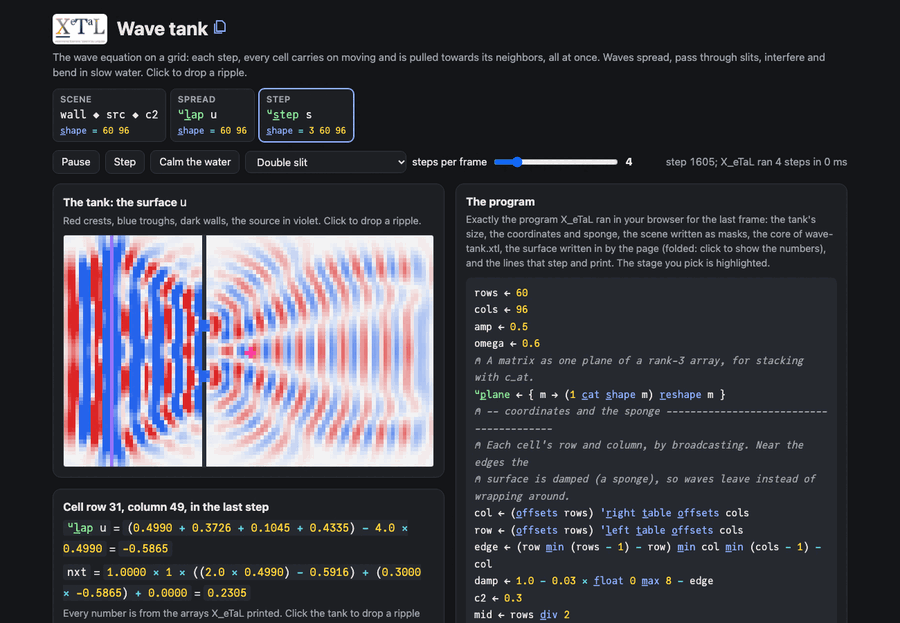

# Wave tank

The wave equation on a grid. Each step, every cell keeps moving the
way it was moving and is pulled towards the level of its neighbors:
next = 2 u - previous + c2 * (neighbors - 4 u). Walls are a mask, a
source shakes a line or a point up and down, and the edges are a
sponge that lets waves leave. Waves spread, pass through a double slit
and interfere (Young's experiment), bend through a lens of slow water,
and ripple where you click. All of it is array expressions over the
whole grid.

Live: [Wave tank](https://softwarewrighter.github.io/X_eTaL-demos/wave-tank/)

[](https://softwarewrighter.github.io/X_eTaL-demos/wave-tank/)

## The program

From `wave-tank.xtl`: the sections the live page runs, with the scene
you pick. The page's program panel shows the whole program it runs:
this core, its settings, the data it writes in (folded) and the lines
that print the arrays it draws.

```
col := (o_ffsets rows) 'r_ight t_able o_ffsets cols
row := (o_ffsets rows) 'l_eft t_able o_ffsets cols
edge := (row m_in (rows - 1) - row) m_in col m_in (cols - 1) - col
damp := 1.0 - 0.03 * f_loat 0 m_ax 8 - edge
slits := ((row >= 13) & row < 16) | (row >= 20) & row < 23
wall := f_loat n_ot (col = 30) & n_ot slits
src := f_loat col = 10
u:l_ap := { x -> ((1 o_-_1 x) + (-1 o_-_1 x) + (1 o_-_2 x) + -1 o_-_2 x) - 4.0 * x }
u:s_tep := { (u, p, t) ->
  drive := amp * src * s_in omega * t
  nxt := damp * wall * ((2.0 * u) - p) + (c2 * u:l_ap u) + drive
  (nxt, u, t + 1.0)
}
```

## How it works

| Part | Code | Shape | What it is |
| ---- | ---- | ----- | ---------- |
| coordinates | `row`, `col` | rows cols | each cell's row and column, by broadcasting with `t_able` |
| the sponge | `damp` | rows cols | 1 inside, less within 8 cells of an edge: waves fade out there instead of wrapping around (rotation wraps) |
| the scene | `wall`, `src`, `c2` | rows cols | masks built from `row` and `col` with comparisons, `&`, `|` and `n_ot`; `c2` is a number, or a map for a lens |
| spread | `u:l_ap u` | rows cols | four shifted copies minus four times the surface |
| step | `u:s_tep (u, p, t)` | rows cols, a 3-tuple | the surface now, a step ago, and the time, taken apart by the pattern and given back as a new tuple |

The same step serves every scene: `c2 * u:l_ap u` works whether `c2`
is one number or a map of slow water (scalar extension). The page's
scenes (double slit, single slit, two point sources, a lens, an open
tank) are each a few lines of X_eTaL, shown beside the step.

On the page, each frame runs a few steps (4 by default) on the surface
the page keeps; X_eTaL prints the last step's arrays (the surface now
and before, the Laplacian, the scene, the sponge, the next surface),
and the inspector shows a cell's arithmetic with those numbers.
Clicking drops a smooth bump (still, so it spreads as a ring).

The page's tests check that every scene runs with a stable wave speed
(c2 at most 0.5), a still tank stays still, one step is exactly the
wave equation above, a ripple spreads while the walls stay at 0, and
time advances.

## Run it

```bash
just run wave-tank          # a double slit after 150 steps, as characters
just show wave-tank         # the same as a notebook
just serve wave-tank        # the web app at http://127.0.0.1:8413/
just test-demo wave-tank    # its CLI and browser baselines and the web app's tests
```

## Workarounds

The page passes the surface into each run as literal matrices,
because each run is a fresh X_eTaL program. (The time used to be
carried as a third plane of the state, the same number in every cell,
read back with `f_irst r_avel t`, because the state had to be one
array; removed now that X_eTaL has tuples, landed D7: the state is
`(u, p, t)`, t a plain scalar.) Listed in
[`docs/xetal-asks.md`](../../docs/xetal-asks.md).
